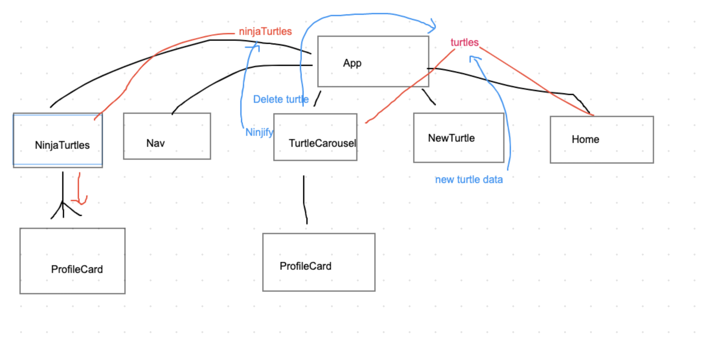

Controlled Forms and Lifting State
======================

## SWBATs

- [x] Write fully controlled forms
- [x] Manipulate the DOM by changing values in `state` instead of using vanilla JS
- [x] Pass data up and down the component hierarchy with our callbacks
- [x] Draw a component hierarchy and describe the Flow of Information

## Lecture Notes

### Forms
How do we capture form data in JS?
- Add event listener to form (submit)
- Capture values of the inputs from
  - Find the input field
  - Grab its value
- Do whatever you need to do with the user input

How do we capture form data in React?
- Fully controlled forms
  - Monitor our inputs and coordinate each input with a value in state 
    - This gives us programmatic access to user input
  - Align the values of our inputs with their respective state values
    - Allows changes to in state to affect the input
  - These 2 together create a 2-way street in which user input is always coordinated with state
- Pass form state to wherever it needs to go -> fetch, passed upwards to parent, etc.

### Lifting State

[Lifting State Up](https://reactjs.org/docs/lifting-state-up.html)

- Often, several components need to reflect the same changing data. We recommend lifting the shared state up to their closest common ancestor.

- If two sibling components need access to the same `state`, you will want to place the shared `state` in a parent container. Then you can pass down that `state` as well as any functions that need to modify the state as props to the two sibling components that need to display and/or change that data.

For Next Lecture:

- [ ] Update a turtle
- [ ] Front-end form validations
- [ ] What happens when you get to the end of the turtles??
- [x] Ninjify???
  - Update the name (Add "Ninja" to the front)
  - Add that turtle to a list of ninjas
  - Give preferred weapon
- [x] Back to the pond????
  - [x] Delete a turtle

### Hierarchy

## Extras

- [Reconciliation](https://reactjs.org/docs/reconciliation.html)
